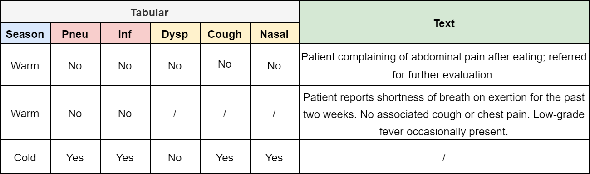

# Clinical Reasoning over Tabular Data and Text with Bayesian Networks

## Summary

This repository contains the code for [Clinical Reasoning over Tabular Data and Text with Bayesian Networks](https://arxiv.org/abs/2403.09481). Should you reuse any ideas from this repository of the accompanying paper, please cite our work as follows: 

```
@misc{prabaey2024clinical,
      title={Clinical Reasoning over Tabular Data and Text with Bayesian Networks},
      author={Paloma Rabaey and Johannes Deleu and Stefan Heytens and Thomas Demeester},
      year={2024},
      eprint={2403.09481},
      archivePrefix={arXiv},
      primaryClass={cs.AI}
}
```

In this paper, we propose two approaches to integrate text in Bayesian networks, to enable joint inference of tabular data and unstructured text. One approach uses a generative text model, while the other uses a discriminative one. We also compare with two types of baselines: a normal Bayesian network trained on only the tabular data and a feed-forward neural network.

<p float="left">
  
  
</p>

We evaluate our models using simulation results for a primary care use case (diagnosis of pneumonia), for which we generate our own dataset. This dataset is based on both expert knowledge (used to build a ground truth Bayesian network) and ChatGPT for generation of a realistic textual description that fits the tabular portion of the sample. An example of what the samples in this dataset look like is shown below. 

<p float="center">

</p>

## Files

notebooks: 
- `data_generation.ipynb`: illustration of the full simulation data generation process 
- `BN_baselines.ipynb`: training and evaluation of two Bayesian network baselines ($BN$ and $BN^{++}$)
- `FF_baseline.ipynb`: training and evaluation of discriminative feed-forward neural network baseline ($\text{ff-discr-text}$)
- `gen_model.ipynb`: training and evaluation of Bayesian network with text generator $(\text{bn-gen-text})$, and its ablated version $(\text{bn-gen-text}^{-})$
- `discr_model.ipynb`: training and evaluation of Bayesian network with text discriminator $(\text{bn-discr-text})$, and its ablated version $(\text{bn-discr-text}^{-})$

`data` directory: 
- `train_4000_final.p`: simulated train dataset (4000 samples)
- `test_1000_final.p`: simulated test dataset (1000 samples)
- `train_4000_final_fever_pain.p`: version of train dataset with observed values for the features "fever" and "pain" (which are normally excluded from the tabular portion of the dataset, and only expressed in text)
- `test_1000_final_fever_pain.p`: versio of test dataset with observed values for the features "fever" and "pain" (idem)
- `suppl`: intermediate data files used in `data_generation.ipynb` to demonstrate the intermediate steps in the data generation process

`utils` directory: 
- `baselines.py`: code to fit Bayesian network baselines
- `data.py`: data generation and processing classes
- `prompt.py`: OpenAI prompting helper functions (used for data generation)
- `models.py`: code to model Bayesian network with text generator $(\text{bn-gen-text}$, $\text{bn-gen-text}^{-})$ and Bayesian network with text discriminator $(\text{bn-discr-text}$, $\text{bn-discr-text}^{-})$
- `evaluation.py`: evaluation code containing methods to calculate KL divergence and predict diagnosis probabilities using Bayesian inference over various model types
