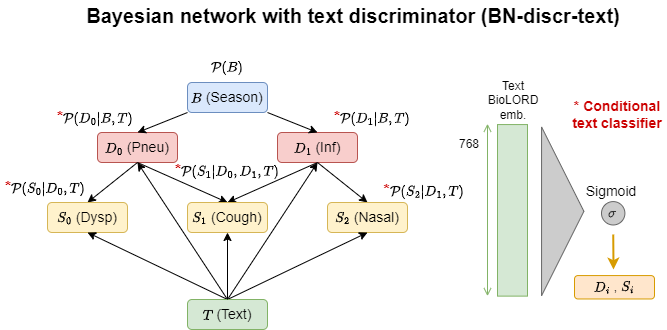

# bn-text

This repository contains the code for [Clinical Reasoning over Tabular Data and Text with Bayesian Networks](https://arxiv.org/abs/2403.09481). Should you reuse any ideas from this repository of the accompanying paper, please cite our work as follows: 

```
@misc{prabaey2024clinical,
      title={Clinical Reasoning over Tabular Data and Text with Bayesian Networks},
      author={Paloma Rabaey and Johannes Deleu and Stefan Heytens and Thomas Demeester},
      year={2024},
      eprint={2403.09481},
      archivePrefix={arXiv},
      primaryClass={cs.AI}
}
```

In this paper, we propose two approaches to integrate text in Bayesian networks, to enable joint inference of tabular data and unstructured text. One approach uses a generative text model, while the other uses a discriminative one. We also compare with two types of baselines: a normal Bayesian network trained on only the tabular data and a feed-forward neural network.

<p float="left">
  
  
</p>

We evaluate our models using simulation results for a primary care use case (diagnosis of pneumonia), for which we generate our own dataset. This dataset is based on both expert knowledge (used to build a ground truth Bayesian network) and ChatGPT for generation of a realistic textual description that fits the tabular portion of the sample. 


